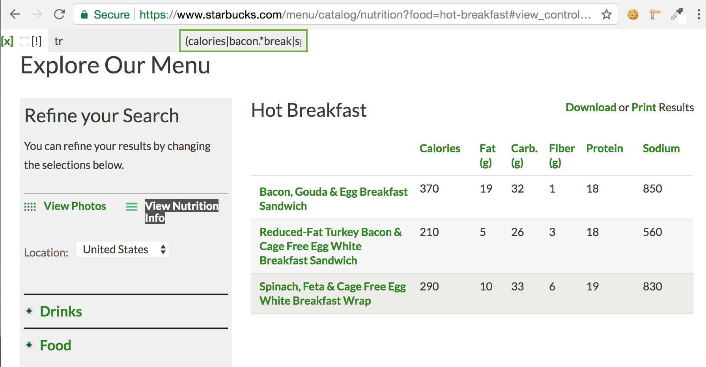

# css-grep

> Greps a regex through DOM elements specified by a CSS selector

This extension puts a few \<input> elements in the top-left corner of the page:

* the first is a CSS selector to match a set of nodes

* the second is a regex that is matched against the .text() of each node

Any nodes that do not match will be hidden from view. Here is an example of
grepping through the Starbucks hot breakfast table:

